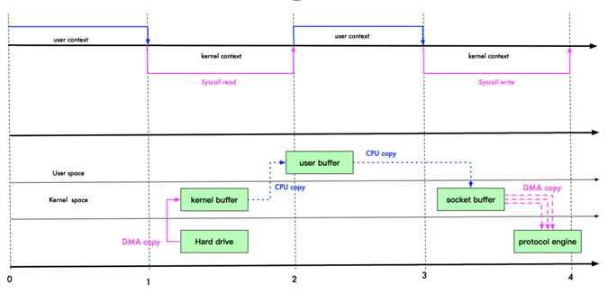
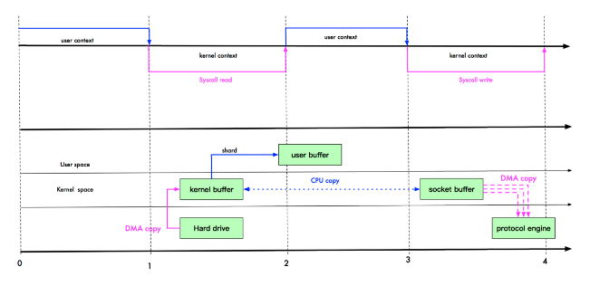
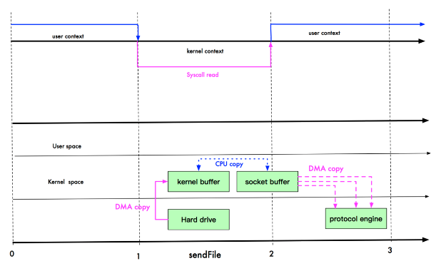
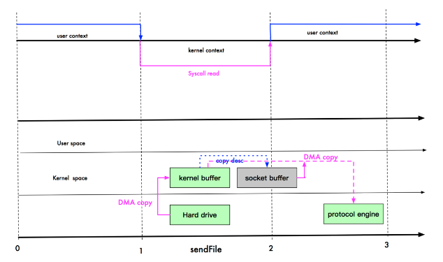

# Deemo-Netty
(:3[▓▓▓▓▓▓▓▓]

## 零拷贝

> 零拷贝是指从操作系统的角度，没有CPU参与的拷贝。
>
> **DMA**：`Direct Memory Access` 直接内存拷贝（不使用 `CPU`）。

### 传统 IO 模型

1. 上下文切换需要 `4` 次，文件拷贝需要 `4` 次

2. 上下文切换与文件拷贝：

   1. `user` -> `kernal`

      切换到内核，将磁盘中的文件 **`DMA`拷贝** 到内核缓冲区

   2. `kernal` -> `user`

      将内核缓冲区中的文件数据 **`CPU`拷贝** 到用户空间

   3. `user` -> `kernal`

      将用户空间中的文件数据 **`CPU`拷贝** 到 `socket` 缓冲区

      将 `socket` 缓冲区中的文件数据 **`DMA`拷贝**到协议栈

   4. `kernal` - > `user`

### mmap 优化

1. `mmap` 通过内存映射，==将文件映射到内核缓冲区，同时用户空间可以共享内核缓冲区的数据==，这样在传输过程中就可以减少内核缓冲区到用户空间的拷贝

2. 上下文切换需要 `4` 次，文件拷贝需要 `3` 次

   1. `user` -> `kernal`

      切换到内核，将磁盘中的文件 **`DMA`拷贝** 到内核缓冲区

   2. `kernal` -> `user`

      ==将内核缓冲区中的文件数据 **`mmap`映射** 到用户空间（减少一次 `CPU拷贝`）==

   3. `user` -> `kernal`

      将内核缓冲区中的文件数据 **`CPU`拷贝** 到 `socket` 缓冲区

      将 `socket` 缓冲区中的文件数据 **`DMA`拷贝**到协议栈

   4. `kernal` - > `user`

### sendFile 优化

#### Linux 2.1

1. Linux 2.1 版本提供了 `sendFile` 函数，其基本原理：==数据不经过用户态，直接从内核缓冲区进入到 `socket` 缓冲区==，同时和用户态完全无关，便减少一次（进、出，便是两次）上下文切换

2. 上下文切换需要 `2` 次，文件拷贝需要 `3` 次

   1. `user` -> `kernal`

      切换到内核，将磁盘中的文件 **`DMA`拷贝** 到内核缓冲区

      将内核缓冲区中的文件数据 **`CPU`拷贝** 到 `socket` 缓冲区（==不经过用户态==）

   2. `kernal` -> `user`

      将 `socket` 缓冲区中的文件数据 **`DMA`拷贝**到协议栈

#### Linux 2.4

1. 在Linux 2.4 版本时，对 `sendFile` 做了一些修改，==避免了从内核缓冲区到 `socket` 缓冲区的 `CPU`拷贝，直接将文件数据从内核缓冲区拷贝到协议栈==，从而再减少了一次拷贝

2. 上下文切换需要 `2` 次，文件拷贝需要 `2` 次

   1. `user` -> `kernal`

      切换到内核，将磁盘中的文件 **`DMA`拷贝** 到内核缓冲区

      仅 **`CPU`拷贝** 一些简单信息到 `socket` 缓冲区（比如：`length`、`offset`）（==忽略该 `CPU`拷贝，不经过用户态==）

   2. `kernal` -> `user`

      将 `socket` 缓冲区中的文件数据 **`DMA`拷贝**到协议栈

### 总结

1. 零拷贝，是指从操作系统的角度来看，`CPU` 没有参与拷贝。在内核缓冲区没有重复文件数据，只有 `kernal` 缓冲区存在一份文件数据
2. 零拷贝不仅带来更少的数据复制，还能带来其他的性能优势：更少的上下文切换、更少的 `CPU` 缓存伪共享、以及无 `CPU` 校验和计算
3. `mmap` 和 `sendFile` 区别：
   1. `mmap` 适合小数据量读写，`sendFile` 适合大文件传输
   2. `mmap` 需要 `4` 次上下文切换，`3` 次数据拷贝；`sendFile` 需要 `2` 次上下文切换，最少 `2` 次数据拷贝
   3. `sendFile` 可以利用 `DMA` 方式，减少 `CPU` 拷贝，`mmap` 则不能（必须从内核拷贝到 `socket`缓冲区）
